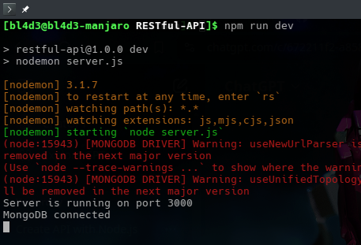
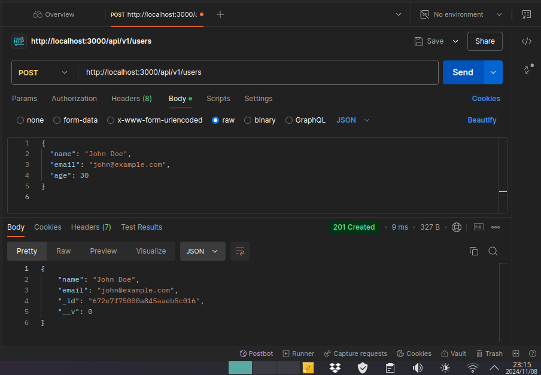
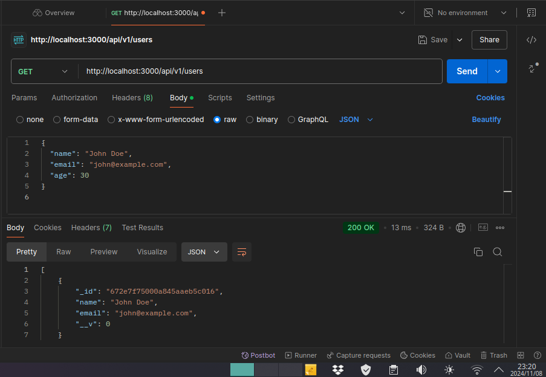
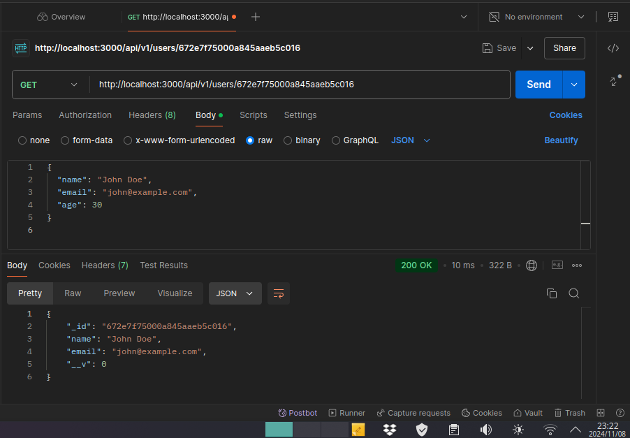
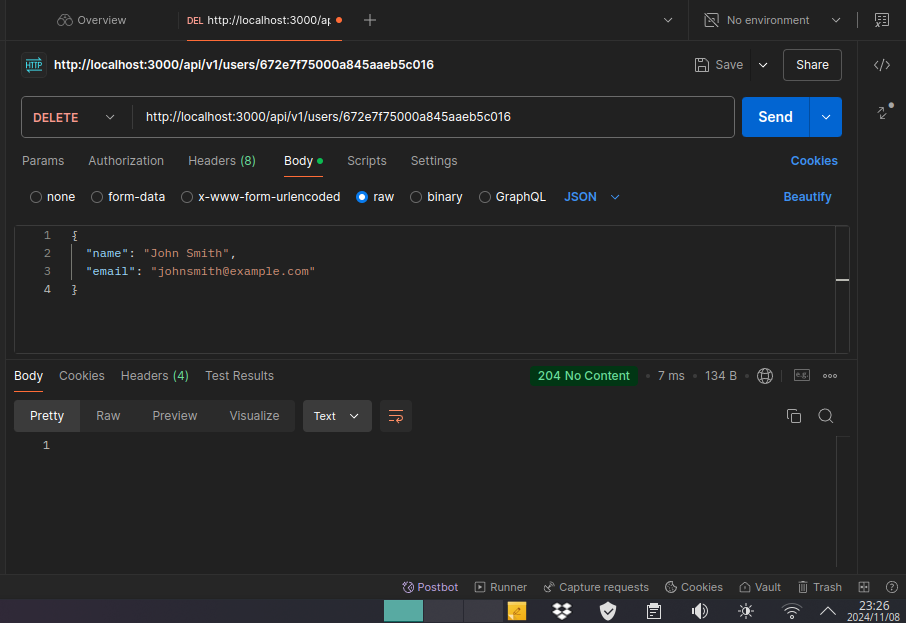

# **User Management API**

This project is a simple RESTful API for managing users, built using Node.js, Express, and MongoDB. It allows basic CRUD (Create, Read, Update, Delete) operations on user data, with routes for fetching all users, fetching a specific user by ID, creating a new user, updating an existing user, and deleting a user.


## Table of Contents

- Features
- Project Structure
- Installation
- Environment Variables
- Endpoints
- Error Handling
- Testing
- Dependencies
---

## Features

- Create a new user with name and email attributes.
- Retrieve a list of all users.
- Get details of a specific user by their ID.
- Update a user’s details.
- Delete a user from the database.
---

## Project Structure

```bash
UserManagementAPI
├── controllers
│   └── userController.js   # Controller functions for handling user routes
├── models
│   └── userModel.js        # Mongoose schema and model for users
├── routes
│   └── userRoutes.js       # Routes for user endpoints
├── middleware
│   └── errorHandler.js     # Global error handling middleware
├── config
│   └── db.js               # MongoDB connection configuration
├── .env                    # Environment variables file
├── .gitignore              # Files and directories to ignore in git
├── package.json            # Project configuration and dependencies
└── server.js               # Main application file to start the server
```
---

## Installation

**Prerequisites**

Ensure that you have the following installed on your machine:

- Node.js and npm (Node Package Manager)
- MongoDB (or use MongoDB Atlas for a cloud-based MongoDB service)

**Steps**

1. Clone the repository:

```bash
git clone https://github.com/Lusanda11/RESTful-API
cd RESTful-API
```

2. Install dependencies:

```bash
npm install
```
---

3. Set up environment variables:
- Create a .env file in the root of the project.
- Define the following environment variables:

```plaintext
MONGO_URI=<your_mongodb_connection_string>
PORT=<port_number> # Optional: defaults to 3000 if not specified
```

4. Start the server:

```bash
npm start
```

The server should now be running at `http://localhost:3000` (or the port you specified).


---

## Environment Variables

- MONGO_URI: Your MongoDB connection string.
- PORT: (Optional) The port on which the server will run. Defaults to 3000 if not specified.


## Endpoints

| Method | Endpoint        | Description               | Body Parameters            |
|--------|------------------|---------------------------|----------------------------|
| GET    | `/api/v1/users`       | Fetch all users           | None                       |
| GET    | `/api/v1/users/:id`   | Fetch a specific user     | None                       |
| POST   | `/api/v1/users`       | Create a new user         | `name`, `email`            |
| PUT    | `/api/v1/users/:id`   | Update an existing user   | `name`, `email` (optional) |
| DELETE | `/api/v1/users/:id`   | Delete a user             | None                       |


## Example Request Body

For POST and PUT requests, use the following JSON format:

```JSON
{
  "name": "John Doe",
  "email": "john.doe@example.com"
}
```
---

## Error Handling

The application includes a global error handler:

- 404 Not Found: Returned if the user does not exist.
- 500 Internal Server Error: Generic error for any server issues.
---

## Testing

**What the API Should Do**

The API is expected to perform basic CRUD operations on user data in a MongoDB database. Specifically:

- Create a User - Adds a new user to the database.
- Retrieve Users - Fetches all users or a single user by ID.
- Update a User - Updates information of a specific user.
- Delete a User - Deletes a user by ID.

**Testing Steps**

1. Start the Server: Ensure the server is running by navigating to the project root and starting the server.

```bash
npm start
# Or, if using nodemon
npm run dev
```

2. Testing with Postman

Open Postman and test each endpoint as follows:

- POST /api/v1/users - Create a new user.

    - In Postman, select POST, set the URL to `http://localhost:3000/api/v1/users`.
    - In the Body tab, choose raw and set it to JSON. Enter JSON data for a new user, like:

```JSON
{
  "name": "John Doe",
  "email": "john@example.com",
  "age": 30
}
```
- Click Send to see if the user is created. You should receive a response with the new user details.

**Results:**



- GET /api/v1/users - Retrieve all users.

    - In Postman, select GET, set the URL to `http://localhost:3000/api/v1/users`, and click Send.
    - This should return a list of all users in the database.

**Results:**



- GET /api/v1/users/
    -Retrieve a single user by ID.

    - In Postman, select GET, and set the URL to `http://localhost:3000/api/v1/users/{user_id}` (replace {user_id} with the actual ID of a user).
    - This should return the details of the specified user if they exist.

**Results:**




- PUT /api/v1/users/
    -Update a user’s details.

    - Select PUT, set the URL to `http://localhost:3000/api/v1/users/{user_id}`, and in the Body tab, enter the updated user details in JSON format:

```JSON
{
  "name": "John Smith",
  "email": "johnsmith@example.com"
}
```
- Click Send to update the user’s information.

**Results:**


- DELETE /api/v1/users/
    -Delete a user.

    - Select DELETE, set the URL to `http://localhost:3000/api/v1/users/{user_id}`, and click Send.
    - The user should be deleted from the database if they exist.

**Results:**



3. **Expected Results**

- Each request should return a JSON response indicating the action was successful.
- Create and Retrieve actions return user data.
- Update actions return the updated user data.
- Delete actions return a success message confirming the deletion.
---

## Dependencies

- `body-parser (^1.20.3)` - Parses incoming request bodies in a middleware, making data easily accessible via req.body.
- `cors (^2.8.5)` - Enables Cross-Origin Resource Sharing, allowing the server to handle requests from different origins.
- `dotenv (^16.4.5)` - Loads environment variables from a .env file into process.env, helping manage configuration securely.
- `express (^4.21.1)` - The main framework for building the RESTful API, handling routing, middleware, and request/response.
- `express-async-handler (^1.2.0)` - Simplifies handling asynchronous code, particularly for routes, by passing errors directly to the error handler.
- `mongoose (^8.8.0)` - Manages interactions with MongoDB, including data schema definition and model creation.

To install dependencies, run:

```bash
npm install
```
---

## Contributing

1. Fork the repository.
2. Create a new branch for your feature (`git checkout -b feature-name`).
3. Commit your changes (`git commit -am 'Add new feature'`).
4. Push to the branch (`git push origin feature-name`).
5. Open a Pull Request.
---

## License

This repository is licensed under The Unlicense.
